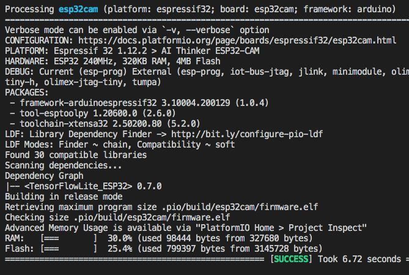
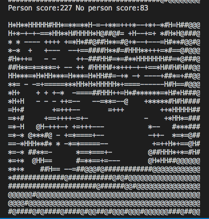
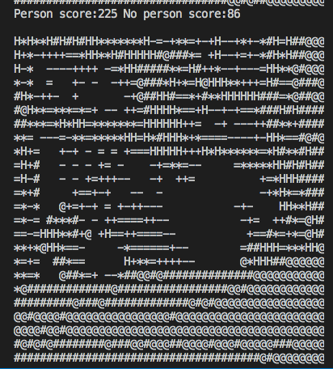
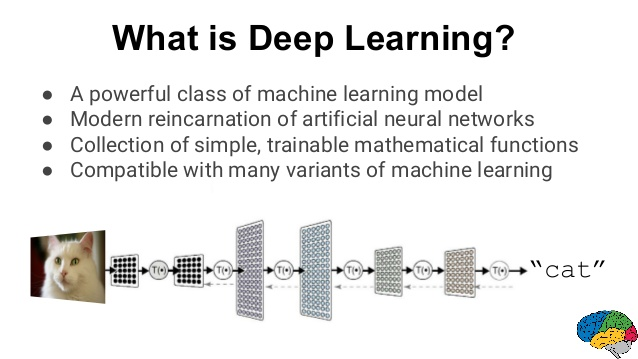

# ESP320-Cam-TensorFlowLite  
Machine Learning person detection responder on micro device (w/ ESP32Cam).
 
example from TensorFlowLite_ESP32 library!
  

 &nbsp;&nbsp;&nbsp;  
 &nbsp;&nbsp;&nbsp;  
  

 Google Keynote Presentation. (check references)
  

## References
  - [TensorFlowLite_ESP32](https://github.com/tanakamasayuki/Arduino_TensorFlowLite_ESP32)  Arduino TensorFlowLite for ESP32 library.
  - [ESP32CAM](https://github.com/espressif/esp32-camera)  Arduino library for ESP32 camera.
  - [Large-Scale Deep Learning for Building Intelligent Computer Systems](https://www.slideshare.net/embeddedvision/largescale-deep-learning-for-building-intelligent-computer-systems-a-keynote-presentation-from-google) a Keynote Presentation from Google
